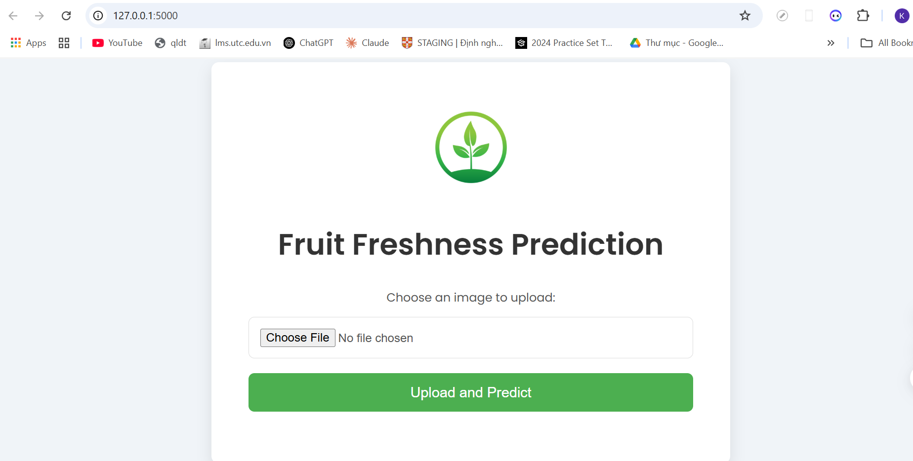
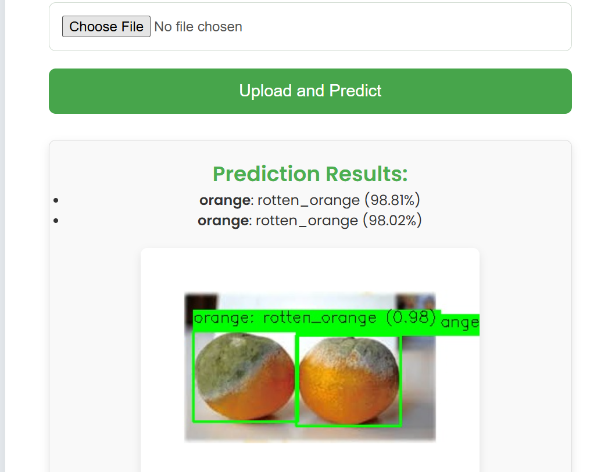
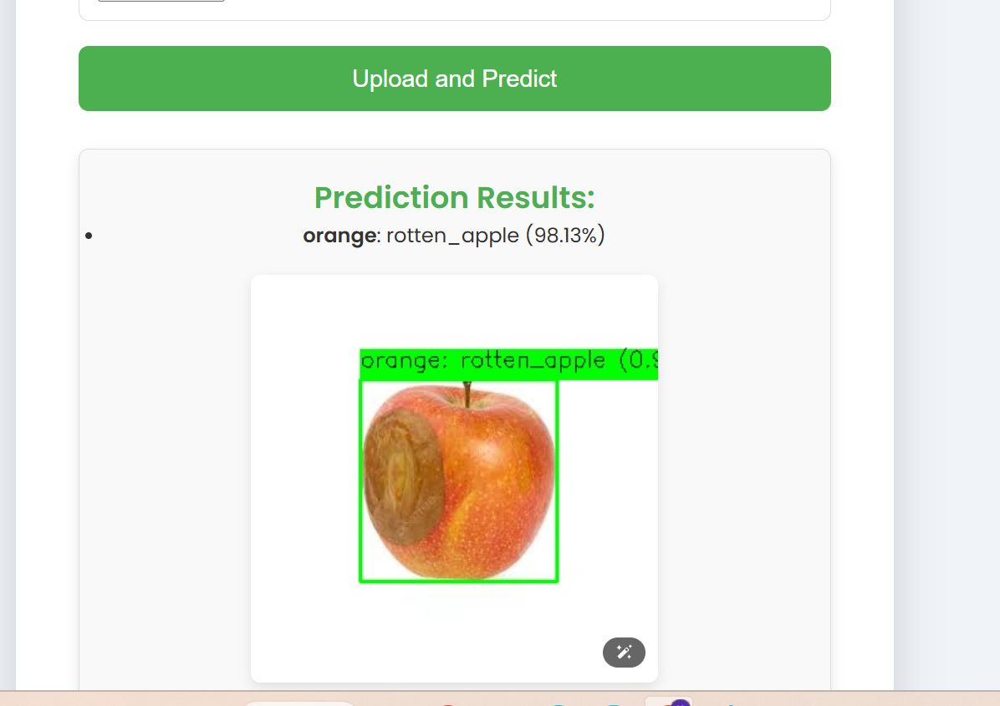
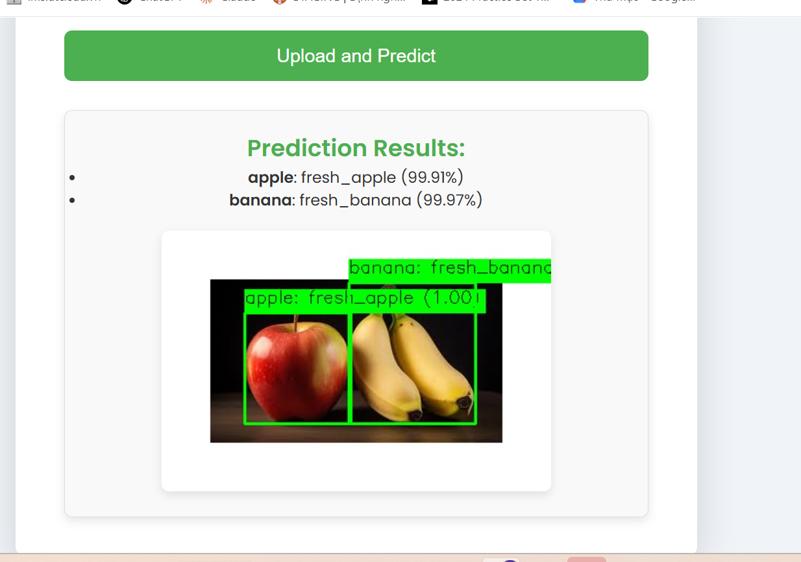
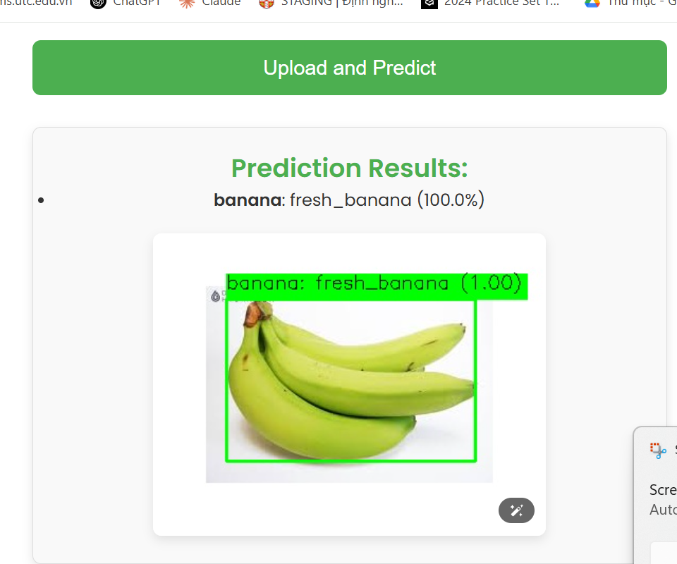
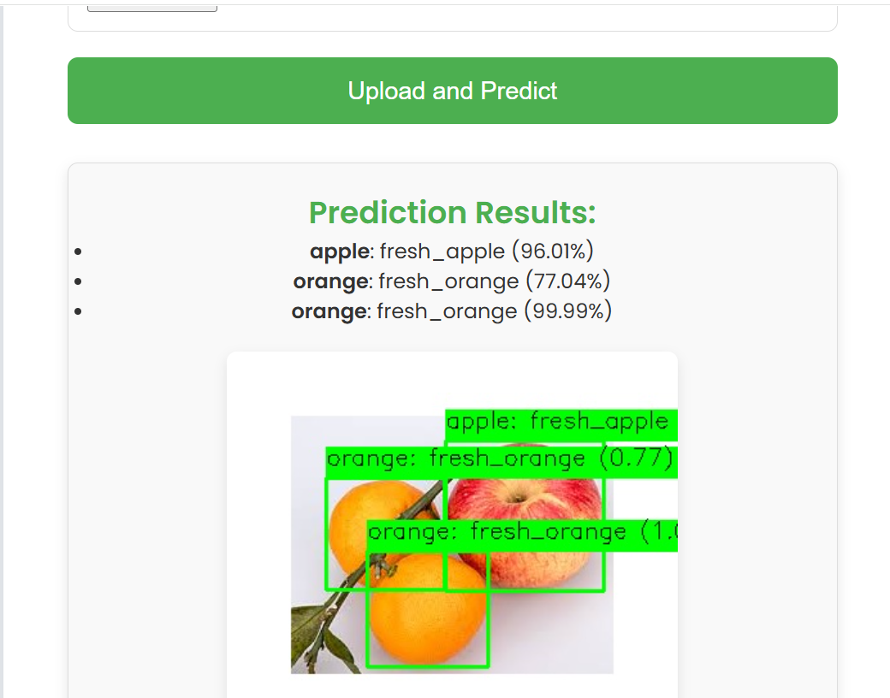
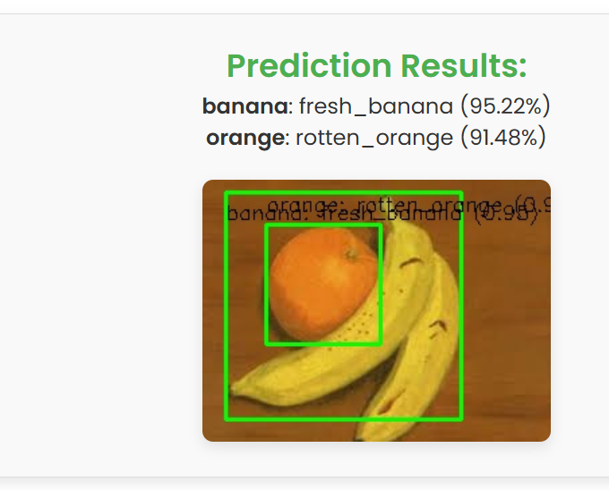

# 🍎 Ứng dụng Dự đoán Độ Tươi của Trái Cây

Đây là một ứng dụng web được xây dựng bằng **Flask**, kết hợp mô hình **YOLOv8** để phát hiện trái cây trong ảnh và **MobileNetV2** để phân loại trái cây là **tươi** hoặc **hư**. Ứng dụng hỗ trợ các loại trái cây: **táo, chuối, cam**.

---

## 🚀 Tính năng

- 📷 Tải ảnh lên từ thiết bị để phân tích
- 🧠 Phát hiện vị trí trái cây trong ảnh với YOLOv8
- 🥭 Phân loại từng trái cây là tươi hay hư bằng MobileNetV2
- 🖼️ Hiển thị kết quả dự đoán trực tiếp trên ảnh
- 📁 Lưu trữ ảnh đã xử lý và vùng cắt từng trái cây

---

## 🛠 Công nghệ sử dụng

| Thành phần | Mô tả |
|-----------|-------|
| Flask | Framework Python để xây dựng ứng dụng web |
| TensorFlow + Keras | Dùng để chạy mô hình phân loại MobileNetV2 |
| YOLOv8 (Ultralytics) | Phát hiện trái cây trong ảnh |
| OpenCV & Pillow | Xử lý hình ảnh |
| HTML/CSS | Giao diện người dùng |

---

## 📦 Cài đặt và chạy dự án
# 🔢 1. Clone dự án
git clone https://github.com/kim-anh-204/Fruit-Quality-Check.

# 🔢 2. Tạo môi trường ảo (tuỳ chọn)
python -m venv venv
source venv/bin/activate  # Windows: venv\Scripts\activate

# 🔢 3. Cài đặt thư viện
pip install -r requirements.txt

# 🔢 4. Chạy ứng dụng
python api.py

# Truy cập ứng dụng tại: http://127.0.0.1:5000

## 🖼️ Giao diện Ứng dụng

Ảnh dưới đây minh họa giao diện web của hệ thống khi người dùng truy cập:

---

## 🎯 Kết quả Dự đoán

Một số quả sau khi tải ảnh lên và xử lý:

| Kết quả | Ảnh minh họa |
|--------|---------------|
| Kết quả 1 |  |
| Kết quả 2 |  |
| Kết quả 3 |  |
| Kết quả 4 |  |
| Kết quả 5 |  |

---

## ⚠️ Một số lỗi thường gặp

| Lỗi | Nguyên nhân & Cách khắc phục |
|-----|------------------------------|
| Nhãn phân loại sai (ví dụ: 🍌 chuối bị nhận thành cam) | Do ảnh bị chồng chéo trái cây, ánh sáng kém hoặc vùng cắt không rõ ràng. → Nên chụp ảnh sáng rõ, mỗi loại trái cây tách biệt càng tốt. |
| Nhãn `fresh_apple` nhưng ảnh là táo hư thật | Mô hình MobileNetV2 chưa đủ dữ liệu huấn luyện → Cần bổ sung dữ liệu đa dạng hơn cho từng loại trái cây. |
| Ảnh có quá nhiều trái cây → Nhầm lẫn nhãn | Cần cải thiện mô hình YOLO hoặc áp dụng lọc hậu xử lý tốt hơn (IoU, confidence). |

---

## 📌 Ví dụ lỗi sai nhãn

| Trường hợp | Ảnh minh họa |
|------------|--------------|
| Chuối bị nhận là cam |  |
| Tất cả đều nhận đúng ngoại trừ chuối |  |

> 💡 Bạn nên đổi tên 2 file ảnh vừa upload thành `example_wrong1.png` và `example_wrong2.png`, sau đó đặt chúng trong thư mục `static/` để hiển thị đúng trên GitHub.

---

## 💡 Gợi ý cải thiện

- Bổ sung tập dữ liệu huấn luyện nhiều ảnh hơn với điều kiện ánh sáng khác nhau.
- Áp dụng kỹ thuật **augmentation** (xoay, lật, làm mờ) để tăng độ chính xác.
- Cho phép người dùng chọn lại nhãn nếu cảm thấy hệ thống đoán sai.

